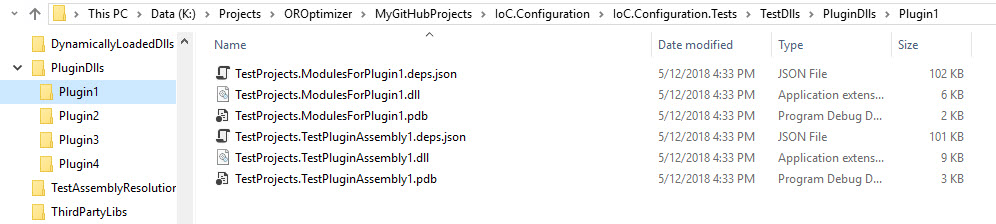

============================
Assemblies and Probing Paths
============================

.. contents::
  :local:
  :depth: 2

Elements **appDataDir**, **plugins**, **additionalAssemblyProbingPaths**, and **assemblies** define the assemblies and pathss that the **IoC.Configuration** will search to locate the assembles.

.. note::
    For more information about plugins refer to section :doc:`./plugins`.

Element: appDataDir
===================

This element specifies the folder, where **IoC.Configuration** saves dynamically generated DLLs. The application should have write permissions to path specified in appDataDir.
Example of **appDataDir** in configuratioon file:

.. code-block:: xml

    <appDataDir path="K:\...\IoC.Configuration.Tests\bin\TestFiles\DynamicFiles" />

Element: plugins
================

This element specified the root folder, where plugin assemblies are (for more information about plugins refer to section :doc:`./plugins`).

**IoC.Configuration** will look for assemblies for plugin declared in **/iocConfiguration/plugins/plugin** element in a sub-folder in root folder that have the same name as the value of attribute **name** in **plugin** element.

An example of **plugins** element:

.. code-block:: xml

    <plugins pluginsDirPath="K:\...\TestDlls\PluginDlls">

        <!--
        Plugin assemblies will be in a folder with similar name under pluginsDirPath folder.
        The plugin folders will be included in assembly resolution mechanism.
        -->

        <!--A folder K:\...\TestDlls\PluginDlls\Plugin1 should exist.  -->
        <plugin name="Plugin1" />
        <plugin name="Plugin2" />
        <plugin name="Plugin3" enabled="false" />
    </plugins>

Here is an example of file structure with plugin folders.

Element: additionalAssemblyProbingPaths
=======================================

This element specifies additional assemblies that **IoC.Configuration** will use for assembly resolution (this includes resolving assemblies defined in element **assemblies** as well as re-solving assemblies, on which assemblies in **assemblies** elements dependend).

Here is an example of **additionalAssemblyProbingPaths** element:

.. code-block:: xml

    <additionalAssemblyProbingPaths>
        <probingPath path="K:\...\TestDlls\ThirdPartyLibs" />
        <probingPath path="K:\...\TestDlls\ContainerImplementations\Autofac" />
        <probingPath path="K:\...\TestDlls\ContainerImplementations\Ninject" />
        <probingPath path="K:\...\TestDlls\DynamicallyLoadedDlls" />
        <probingPath path="K:\...\TestDlls\TestAssemblyResolution" />
    </additionalAssemblyProbingPaths>

Element: assemblies and assembly
=================================

The elements **assemblies** and **assembly** specify all the assemblies that can be used in types in XML configuration file. The assemblies in **assemblies** and their dependencies are resolved by looking up for assemblies in folders specified in elements **plugins**, and **additionalAssemblyProbingPaths**, in addition to default folders (e.g., application startup folder, standard folder for **.Net Core** asemblies, etc).

Here is an example of **assemblies** element:

.. code-block:: xml
    :linenos:

        <assemblies>
            <assembly name="TestProjects.TestForceLoadAssembly"
                          alias="TestForceLoadAssembly" loadAlways="true"
                          overrideDirectory="K:\...\TestDlls\DynamicallyLoadedDlls" />

            <assembly name="OROptimizer.Shared" alias="oroptimizer_shared" />
            <assembly name="IoC.Configuration" alias="ioc_config" />
            <assembly name="IoC.Configuration.Autofac" alias="autofac_ext" />
            <assembly name="IoC.Configuration.Ninject" alias="ninject_ext" />

            <assembly name="TestProjects.Modules" alias="modules" />
            <assembly name="TestProjects.DynamicallyLoadedAssembly1" alias="dynamic1" />
            <assembly name="TestProjects.DynamicallyLoadedAssembly2" alias="dynamic2" />

            <assembly name="TestProjects.TestPluginAssembly1" alias="pluginassm1" plugin="Plugin1" />
            <assembly name="TestProjects.ModulesForPlugin1" alias="modules_plugin1" plugin="Plugin1" />
            <assembly name="TestProjects.TestPluginAssembly2" alias="pluginassm2" plugin="Plugin2" />
            <assembly name="TestProjects.TestPluginAssembly3" alias="pluginassm3" plugin="Plugin3" />

            <assembly name="TestProjects.SharedServices" alias="shared_services" />
            <assembly name="IoC.Configuration.Tests" alias="tests" />
        </assemblies>

Attributes in **assembly** element
----------------------------------

- **name**: Specifies the assembly name without the file extension. Example of this attribute value is **IoC.Configuration.Autofac** (see the XML above).
- **alias**: A short unique alias to use, when referencing the assembly in other elements.
    Here is an example of element that references the assembly with alias **dynamic1**:

    .. code-block:: xml

        <services>
            <service type="DynamicallyLoadedAssembly1.Interfaces.IInterface1" assembly="dynamic1">
                <implementation type="DynamicallyLoadedAssembly1.Implementations.Interface1_Impl1"
                                assembly="dynamic1" scope="singleton">
                </implementation>
            </service>
        </services>

- **plugin**: All assemblies that are in plugin folder should include this attribute with value specifying the plugin name.
    Here is an example of assembly **TestProjects.ModulesForPlugin1** with the value of attribute plugin being **Plugin1**.

    .. code-block:: xml

        <assembly name="TestProjects.ModulesForPlugin1" alias="modules_plugin1" plugin="Plugin1" />

    .. note::
            There should exist some **plugin** element under element **plugins**, with the value of attribute **name** equal to **Plugin1**.

- **overrideDirectory**: Specifies the directory, where the assembly should be loaded from. Normally this attribute should not be included in element, and the folders specified in elements **plugins**, and **additionalAssemblyProbingPaths**, in addition to default folders will be searched to locate tbe assembly.
  .. note::
    Use this attribute in rare circumstances, to override the default behaviour.

- **loadAlways**: Normally the assembly will be loaded only if it is used in some type in XML configuration file. Use this attribute, if for some reason the assembly should be explicitly loaded into application domain regardless if it is used in some type in configuration file or not.
    Here is an example of **loadAlways** attribute usage.

    .. code-block:: xml

        <assembly name="TestProjects.TestForceLoadAssembly"
                              alias="TestForceLoadAssembly" loadAlways="true"
                              overrideDirectory="K:\...\TestDlls\DynamicallyLoadedDlls" />